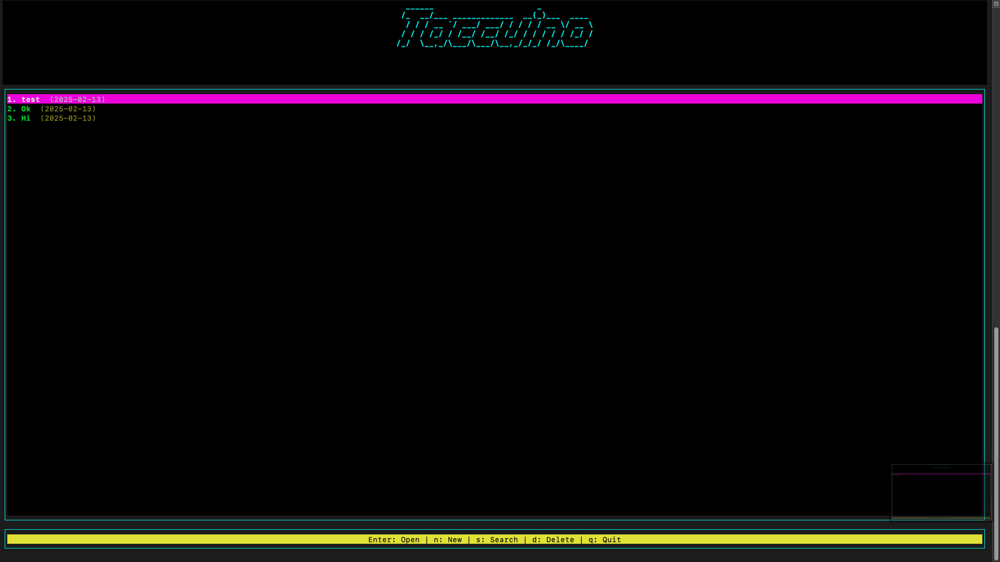

# Taccuino

<p align="center">
  
  <br><strong>Command-line tool for monitoring financial data and market trends in real-time directly from your terminal.</strong>
  <br><a href="https://github.com/JustSouichi/finview">GitHub Repository</a>
</p>

[](https://raw.githubusercontent.com/JustSouichi/taccuino/refs/heads/main/LICENSE)
[](https://github.com/JustSouichi/taccuino/issues)
[](https://github.com/JustSouichi/taccuino/stargazers)
[](https://www.npmjs.com/package/taccuino)

Taccuino is a **terminal-based note manager** designed to provide a seamless CLI experience for creating, editing, searching, and managing notes. It utilizes **Blessed** for UI rendering and **Figlet** for ASCII banners, offering an intuitive, full-screen interface.




---

## Features

- **Full-Screen CLI UI**: Uses [Blessed](https://www.npmjs.com/package/blessed) for an interactive terminal interface.
- **Persistent Notes**: Notes are stored in an external directory, avoiding loss after NPM package updates.
- **Create & Edit Notes**: Simple UI for creating and modifying notes.
- **Search Functionality**: Easily find notes by keywords.
- **Deletion Confirmation**: Ensures safety before removing notes.
- **Customizable Color Themes**: Modify themes via the `theme` object.
- **OS-Aware Storage**: Notes are saved based on the OS directory structure.

---

## Installation

### Install via NPM

```bash
npm install -g taccuino
```

### Clone Manually

```bash
git clone https://github.com/JustSouichi/taccuino.git
cd taccuino
npm install
```

---

## Usage

### Open Taccuino

```bash
taccuino open
```

### Navigate
- Use **arrow keys** (or `j/k` in vi mode) to browse notes.
- Press **Enter** to open a note.
- Press **n** to create a new note.
- Press **s** to search notes.
- Press **d** to delete a note.
- Press **q** to quit.

### Creating a Note
- Enter a **title** and **content**.
- Use **Submit** to save or **Cancel** to go back.

### Editing a Note
- Press **e** while viewing a note to edit.
- Modify **title** or **content**, then **Save**.

### Searching Notes
- Enter a search query.
- Matching notes are displayed.
- Select a note to open.

### Deleting Notes
- Select a note and press **d**.
- Confirm by typing `YES`.
- Notes cannot be recovered after deletion.

---

## Configuration

Taccuino detects your OS and stores notes accordingly:
- **Windows**: `%APPDATA%\Taccuino\notes`
- **macOS**: `~/Library/Application Support/Taccuino/notes`
- **Linux**: `~/.taccuino/notes`

To change the directory, modify `getNotesDir()` in `index.js`.

---

## Contributing

Contributions are welcome! To contribute:
1. **Fork** this repository.
2. **Create** a new branch: `git checkout -b feature/my-feature`.
3. **Commit** changes: `git commit -m 'Add feature'`.
4. **Push** to the branch: `git push origin feature/my-feature`.
5. **Submit** a pull request.

Check [issues page](https://github.com/JustSouichi/taccuino/issues) for ongoing discussions.

---

## License

Taccuino is licensed under the [MIT License](./LICENSE). Feel free to modify and share the project.

---

### Enjoy using Taccuino! 🚀

